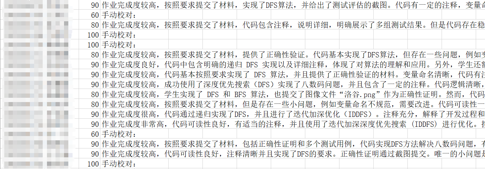

# gpt-is-all-you-need

## How to use

```
choco install pandoc # 手动安装 pandoc
pip install pypandoc PyMuPDF openai tqdm pandas chardet
python main.py # 自动打分并生成评语，你需要修改文件开头的 API_KEY, BASE_URL, problem, prompt 变量以满足你的需求
python manual.py
# 分数映射
# 手动校准，会过一遍原始分数在 THRESHOLD(文件开头) 以下的作业，你可以此时手动打分（不会经过映射）和评语
# 输出删除评语的可以提交给 obe 的文件
```

## 说明

目前的功能包括：

- 解压 .zip 压缩包（只能解压一层）
- 解析 PDF, DOCX 到 Markdown
- 如果你已经解压好了文件，你
- 将文本类文件合并到 prompt 中向 GPT 提问
- 图片会告知 GPT 这里有一个图片，但是不能直接输入图片（API 限制）

## 最大的问题

请严格要求学生使用开源的格式，比如：

- 不要用 doc，用 docx
- 不要用 rar，用 zip

实现这些封闭格式的解析非常的烦，工具的支持很烂。

## 生成效果

